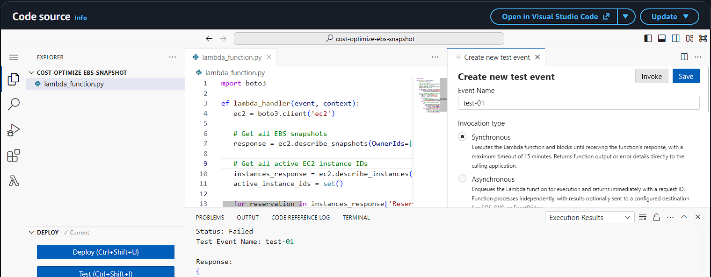
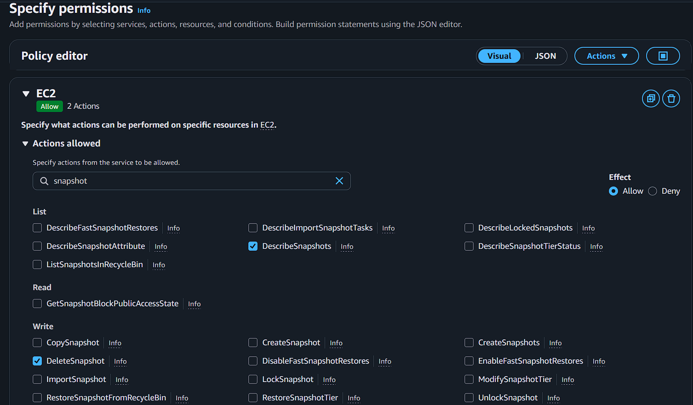
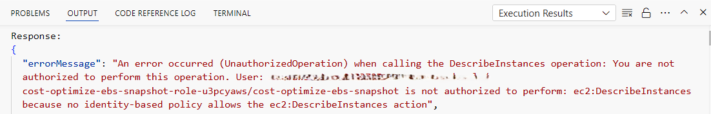
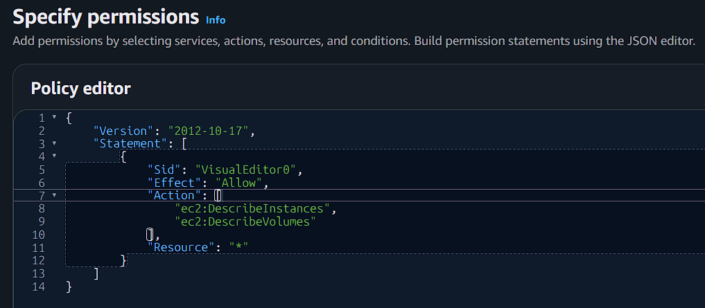
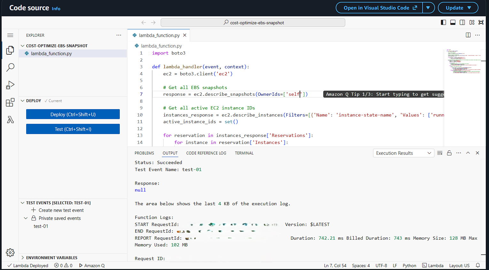
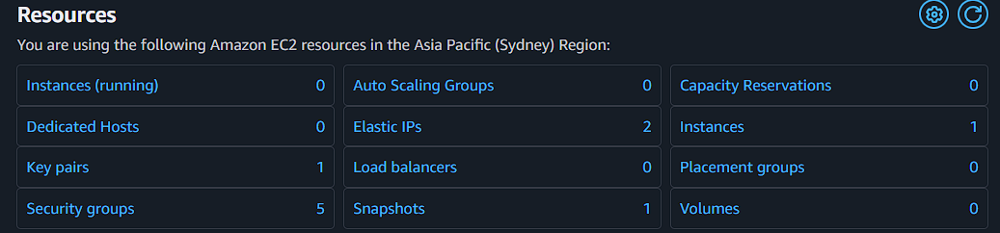
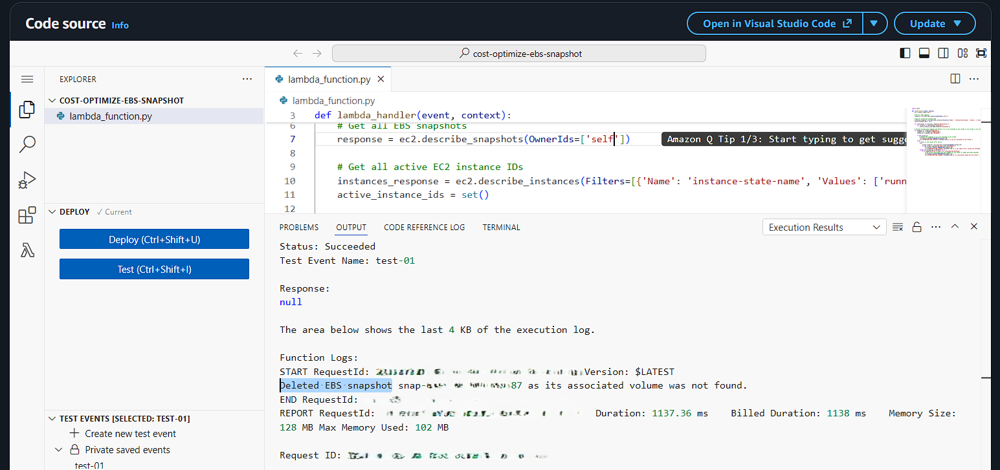
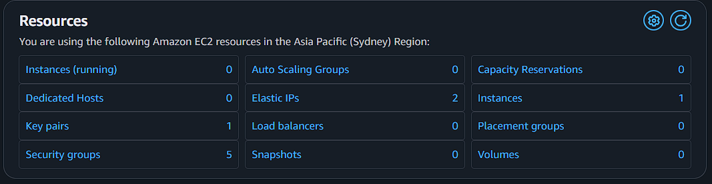

# Cost Optimization for Stale EBS Snapshots

An AWS automation project that identifies and removes **stale Amazon EBS snapshots** whose source volumes no longer exist or are no longer attached, helping prevent unnecessary snapshot storage costs.

The solution uses **AWS Lambda + Amazon EC2 APIs** and can be automated with a scheduled CloudWatch trigger.

---

##  Problem Statement

EBS snapshots can continue to exist even after the EC2 instance and its attached EBS volume have been deleted.

For example:

```text
EC2 Instance
    │
    └── EBS Volume
           │
           └── EBS Snapshot
```

If the instance is terminated and the volume is deleted, the snapshot can still remain:

```text
EC2 Instance      Deleted
EBS Volume        Deleted
EBS Snapshot      Still exists
```

The remaining snapshot continues to consume snapshot storage and can therefore create unnecessary AWS costs.

This project automates the cleanup of such stale snapshots.

---

## Objective

The Lambda function:

1. Retrieves all EBS snapshots owned by the AWS account.
2. Retrieves currently running EC2 instances.
3. Checks the volume associated with each snapshot.
4. Deletes snapshots whose associated volume:
   - does not exist, or
   - has no attachment.
5. Logs every deletion for verification.

The project was initially tested manually and can be scheduled for automatic execution.

---

## Architecture

```text
                ┌──────────────────────┐
                │   CloudWatch Event   │
                │   Scheduled Trigger  │
                └──────────┬───────────┘
                           │
                           ▼
                ┌──────────────────────┐
                │     AWS Lambda       │
                │ stale-snapshot       │
                │      cleanup         │
                └──────────┬───────────┘
                           │
              ┌────────────┼────────────┐
              │            │            │
              ▼            ▼            ▼
       DescribeSnapshots  Describe     Describe
                         Instances      Volumes
              │            │            │
              └────────────┼────────────┘
                           │
                           ▼
                ┌──────────────────────┐
                │ Identify stale EBS   │
                │     snapshots        │
                └──────────┬───────────┘
                           │
                           ▼
                ┌──────────────────────┐
                │   DeleteSnapshot     │
                └──────────────────────┘
```

---

## AWS Services Used

| Service | Purpose |
|---|---|
| **AWS Lambda** | Runs the cleanup logic without managing servers |
| **Amazon EC2** | Provides instances, EBS volumes and snapshots being evaluated |
| **Amazon EBS** | Snapshot storage being cleaned up |
| **AWS IAM** | Controls permissions required by the Lambda function |

---

## Suggested Project Structure

```text
cost-optimization-for-stale-ebs-snapshots/
│
├── lambda_function.py
├── README.md
│
└── images/
    ├── cost-opt-01.png
    ├── cost-opt-02.png
    ├── cost-opt-03.png
    ├── cost-opt-04.png
    ├── cost-opt-05.png
    ├── cost-opt-06.png
    ├── cost-opt-07.png
    └── cost-opt-08.png
```

> If the screenshots are kept in the repository root instead, remove `screenshots/` from the image paths below.

---

# Lambda Function

```python
import boto3


def lambda_handler(event, context):
    ec2 = boto3.client("ec2")

    # Get all EBS snapshots owned by this AWS account
    response = ec2.describe_snapshots(OwnerIds=["self"])

    # Get all currently running EC2 instances
    instances_response = ec2.describe_instances(
        Filters=[
            {
                "Name": "instance-state-name",
                "Values": ["running"]
            }
        ]
    )

    active_instance_ids = set()

    for reservation in instances_response["Reservations"]:
        for instance in reservation["Instances"]:
            active_instance_ids.add(instance["InstanceId"])

    # Check every EBS snapshot
    for snapshot in response["Snapshots"]:
        snapshot_id = snapshot["SnapshotId"]
        volume_id = snapshot.get("VolumeId")

        # Snapshot has no associated volume
        if not volume_id:
            ec2.delete_snapshot(SnapshotId=snapshot_id)

            print(
                f"Deleted EBS snapshot {snapshot_id} "
                "as it was not attached to any volume."
            )

            continue

        try:
            # Check whether the source volume still exists
            volume_response = ec2.describe_volumes(
                VolumeIds=[volume_id]
            )

            volume = volume_response["Volumes"][0]

            # Delete if the source volume has no attachment
            if not volume["Attachments"]:
                ec2.delete_snapshot(SnapshotId=snapshot_id)

                print(
                    f"Deleted EBS snapshot {snapshot_id} "
                    "as it was taken from a volume not attached "
                    "to any running instance."
                )

        except ec2.exceptions.ClientError as e:
            # Source volume no longer exists
            if e.response["Error"]["Code"] == "InvalidVolume.NotFound":
                ec2.delete_snapshot(SnapshotId=snapshot_id)

                print(
                    f"Deleted EBS snapshot {snapshot_id} "
                    "as its associated volume was not found."
                )
            else:
                raise
```

### How the logic works

The Lambda function first calls:

```python
ec2.describe_snapshots(OwnerIds=["self"])
```

to obtain snapshots belonging to the current AWS account.

It then retrieves running EC2 instances using:

```python
ec2.describe_instances(
    Filters=[
        {
            "Name": "instance-state-name",
            "Values": ["running"]
        }
    ]
)
```

For every snapshot, the function obtains its `VolumeId`.

The snapshot is considered stale when its source volume is unavailable or has no attachment.

---

# IAM Permissions

The Lambda execution role requires permissions to inspect EC2 resources and delete snapshots.

The permissions used during the project were:

```json
{
    "Version": "2012-10-17",
    "Statement": [
        {
            "Sid": "StaleEBSSnapshotCleanup",
            "Effect": "Allow",
            "Action": [
                "ec2:DescribeSnapshots",
                "ec2:DeleteSnapshot",
                "ec2:DescribeInstances",
                "ec2:DescribeVolumes"
            ],
            "Resource": "*"
        }
    ]
}
```

### Required actions

| IAM Action | Purpose |
|---|---|
| `ec2:DescribeSnapshots` | Read EBS snapshot information |
| `ec2:DeleteSnapshot` | Delete stale snapshots |
| `ec2:DescribeInstances` | Identify running EC2 instances |
| `ec2:DescribeVolumes` | Check whether snapshot source volumes still exist and are attached |

---

# Lambda Configuration

During testing, the default Lambda timeout caused the first execution to fail.

The timeout was increased:

```text
Default timeout: 3 seconds
Updated timeout: 10 seconds
```

This provided sufficient execution time for the EC2 API calls and snapshot evaluation.

---

# Testing / Validation

The project was validated using a controlled EC2 instance.

### Test setup

1. Launch an EC2 instance.
2. Use its default root EBS volume.
3. Create an EBS snapshot of the volume.
4. Verify that the snapshot exists.
5. Terminate the EC2 instance.
6. The attached volume is automatically deleted.
7. The EBS snapshot remains.

At this point the expected state is:

```text
Running instances : 0
Volumes            : 0
Snapshots          : 1
```

The Lambda function is then executed again.

Expected result:

```text
Running instances : 0
Volumes            : 0
Snapshots          : 0
```

The deleted snapshot was also verified through the AWS console.

---

# Screenshots

### 1. Test Creation



### 2. Lambda Permissions



### 3. Lambda Permission Error



### 4. Updated Permissions



### 5. Successful execution of the function



### 6. Test Environment/Resources-in-use



### 7. Stale Snapshot Detected



### 8. Snapshot Successfully Removed



---

# Automation

The Lambda function can be connected to a scheduled CloudWatch event so that stale snapshots are cleaned up periodically.

Example workflow:

```text
CloudWatch Schedule
        │
        ▼
AWS Lambda
        │
        ▼
Find EBS Snapshots
        │
        ▼
Check Source Volumes
        │
        ├── Volume exists & attached
        │          │
        │          └── Keep snapshot
        │
        └── Volume missing/unattached
                   │
                   ▼
            Delete snapshot
```

This removes the need for manual execution.

---

# Cost Optimization Benefit

The main purpose of this project is to prevent **unnecessary EBS snapshot storage costs**.

Without cleanup:

```text
Terminated Instance
       ↓
Deleted Volume
       ↓
Snapshot remains
       ↓
Storage charges continue
```

With automated cleanup:

```text
Terminated Instance
       ↓
Deleted Volume
       ↓
Lambda detects stale snapshot
       ↓
Snapshot deleted
       ↓
Unnecessary storage cost avoided
```

The actual savings depend on the number and size of stale snapshots and the AWS region/storage pricing.

---

# Important Considerations

Because this function performs a destructive operation (`DeleteSnapshot`), it should be deployed carefully.

Before using it in a production AWS account:

- Test it in a non-production environment first.
- Make sure snapshots required for backup, disaster recovery, compliance, or rollback are protected from deletion.
- Consider adding an explicit age/tag policy before deleting snapshots in a production implementation.
- Review CloudWatch/Lambda logs after deployment.
- Consider using resource tags or an allow/deny list for snapshots that must be retained.

> **Warning:** This implementation is intentionally based on the stale-snapshot criteria demonstrated in the project. Production environments may require more restrictive retention rules.

---

# Deployment Steps

### 1. Create the Lambda function

Create an AWS Lambda function using the Python runtime and place the cleanup code in `lambda_function.py`.

### 2. Configure the IAM execution role

Attach a policy containing:

```text
ec2:DescribeSnapshots
ec2:DeleteSnapshot
ec2:DescribeInstances
ec2:DescribeVolumes
```

### 3. Configure timeout

Set the Lambda timeout to at least:

```text
10 seconds
```

Increase it further if the account contains a large number of snapshots/resources.

### 4. Test manually

Run the Lambda using a test event.

The function does not require a specific event payload for the cleanup logic, so an empty JSON event can be used:

```json
{}
```

### 5. Verify CloudWatch logs

Check the Lambda execution logs for messages such as:

```text
Deleted EBS snapshot snap-xxxxxxxx
```

### 6. Add scheduled execution

Create a scheduled CloudWatch trigger according to the desired cleanup frequency.

---

# Project Summary

| Component | Implementation |
|---|---|
| Compute | AWS Lambda |
| Cloud resources checked | EC2 Instances, EBS Volumes, EBS Snapshots |
| Language | Python |
| SDK | Boto3 |
| Automation | CloudWatch scheduled trigger |
| Cleanup operation | `ec2:DeleteSnapshot` |
| Main objective | Reduce unnecessary EBS snapshot storage |
| Testing | EC2 termination + stale snapshot cleanup |

---

## Author

**Manaansh Choudhary**

---
